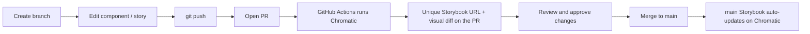

# Antino Design System

A component library built with [shadcn/ui](https://ui.shadcn.com), React, TypeScript, Tailwind CSS v4, and Vite. Components are developed and previewed in isolation with [Storybook](https://storybook.js.org), and every branch/PR gets a live, published Storybook preview via [Chromatic](https://www.chromatic.com).

## Tech stack

- **React 19 + TypeScript + Vite** - app/build tooling
- **Tailwind CSS v4** - styling (via `@tailwindcss/vite`)
- **shadcn/ui** - all components live in `src/components/ui/`
- **Storybook 10** - component explorer with light/dark theme toggle
- **Chromatic** - per-PR Storybook publishing + visual regression testing

## Getting started

```bash
npm install
npm run storybook   # open Storybook at http://localhost:6006
npm run dev         # run the demo app at http://localhost:5173
```

## Scripts

| Command | Description |
| --- | --- |
| `npm run dev` | Start the Vite demo app |
| `npm run build` | Type-check and build the app |
| `npm run storybook` | Run Storybook locally |
| `npm run build-storybook` | Build a static Storybook |
| `npm run chromatic` | Publish Storybook to Chromatic (needs a project token) |
| `npm run lint` | Run ESLint |

## Project structure

```
src/
  components/ui/      # all shadcn components + their *.stories.tsx
  hooks/             # shared hooks (e.g. use-mobile)
  lib/utils.ts       # cn() helper
  index.css          # Tailwind import + design tokens (light/dark)
.storybook/          # Storybook config (Tailwind + theme decorator)
.github/workflows/   # Chromatic CI
```

## Adding / updating components

Add another shadcn component at any time:

```bash
npx shadcn@latest add <component>
```

Then create a matching `src/components/ui/<component>.stories.tsx` so it shows up in Storybook. Existing stories (e.g. `button.stories.tsx`) are good templates.

## Theming in Storybook

Use the **Theme** toolbar control (sun/moon) at the top of Storybook to toggle light/dark. The decorator in `.storybook/preview.tsx` toggles the `.dark` class so the shadcn design tokens in `src/index.css` switch accordingly.

## Chromatic setup (one time)

1. Go to [chromatic.com](https://www.chromatic.com), sign in with GitHub, and create a project linked to the `antinolabs/design-system` repo.
2. Copy the **project token**.
3. Publish the baseline locally:

   ```bash
   npx chromatic --project-token=<your-token>
   ```

4. Add the token to GitHub so CI can publish on every push: repo **Settings -> Secrets and variables -> Actions -> New repository secret**, named `CHROMATIC_PROJECT_TOKEN`.

After this, `.github/workflows/chromatic.yml` publishes Storybook on every push automatically.

## Day-to-day workflow



1. **Create a branch**

   ```bash
   git checkout -b feature/my-change
   ```

2. **Edit** a component in `src/components/ui/` and/or its `*.stories.tsx`. Preview locally with `npm run storybook`.

3. **Commit and push**

   ```bash
   git add .
   git commit -m "feat: update button hover state"
   git push -u origin feature/my-change
   ```

4. **Open a PR** on GitHub. The Chromatic check posts a unique Storybook URL for that branch and flags any visual changes.

5. **Review** the visual diffs in Chromatic, approve them, then **merge** the PR. After merge, the `main` Storybook on Chromatic updates automatically and the code is in `main`.
