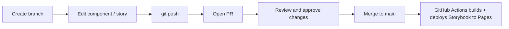

# Antino Design System

A component library built with [shadcn/ui](https://ui.shadcn.com), React, TypeScript, Tailwind CSS v4, and Vite. Components are developed and previewed in isolation with [Storybook](https://storybook.js.org), which is published to GitHub Pages on every push to `main`: <https://antinolabs.github.io/design-system/>.

## Tech stack

- **React 19 + TypeScript + Vite** - app/build tooling
- **Tailwind CSS v4** - styling (via `@tailwindcss/vite`)
- **shadcn/ui** - all components live in `src/components/ui/`
- **Storybook 10** - component explorer with light/dark theme toggle
- **GitHub Pages** - hosts the published Storybook, auto-deployed by GitHub Actions

## Getting started

```bash
npm install
npm run storybook   # open Storybook at http://localhost:6006
npm run dev         # run the demo app at http://localhost:5173
```

## Scripts

| Command | Description |
| --- | --- |
| `npm run dev` | Start the Vite demo app |
| `npm run build` | Type-check and build the app |
| `npm run storybook` | Run Storybook locally |
| `npm run build-storybook` | Build a static Storybook into `storybook-static/` |
| `npm run lint` | Run ESLint |

## Project structure

```
src/
  components/ui/<name>/   # one folder per component: <name>.tsx, <name>.stories.tsx, index.ts
  hooks/                  # shared hooks (e.g. use-mobile)
  lib/utils.ts            # cn() helper
  index.css               # Tailwind import + design tokens (light/dark)
.storybook/               # Storybook config (Tailwind + theme decorator)
.github/workflows/        # CI: build + deploy Storybook to GitHub Pages
```

## Adding / updating components

Add another shadcn component at any time:

```bash
npx shadcn@latest add <component>
```

The CLI drops a flat `src/components/ui/<component>.tsx`. Move it into the folder convention: `src/components/ui/<component>/<component>.tsx`, add an `index.ts` with `export * from './<component>'`, and create a matching `<component>.stories.tsx` so it shows up in Storybook. Existing components (e.g. `button/`) are good templates.

## Theming in Storybook

Use the **Theme** toolbar control (sun/moon) at the top of Storybook to toggle light/dark. The decorator in `.storybook/preview.tsx` toggles the `.dark` class so the shadcn design tokens in `src/index.css` switch accordingly.

## Hosting on GitHub Pages (one time)

Storybook is published to GitHub Pages by `.github/workflows/deploy-storybook.yml` on every push to `main`.

1. In the repo, go to **Settings -> Pages**.
2. Under **Build and deployment -> Source**, select **GitHub Actions**.

That's it. After the next push to `main`, the live Storybook is available at
<https://antinolabs.github.io/design-system/>. (GitHub Pages on a private repo requires a paid GitHub plan.)

## Day-to-day workflow



1. **Create a branch**

   ```bash
   git checkout -b feature/my-change
   ```

2. **Edit** a component in `src/components/ui/` and/or its `*.stories.tsx`. Preview locally with `npm run storybook`.

3. **Commit and push**

   ```bash
   git add .
   git commit -m "feat: update button hover state"
   git push -u origin feature/my-change
   ```

4. **Open a PR** on GitHub and have it reviewed.

5. **Merge** the PR. After merge to `main`, GitHub Actions rebuilds and redeploys the published Storybook to GitHub Pages automatically.
